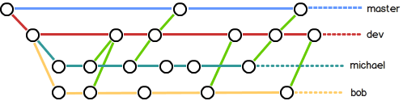

# Git教程
[toc]


----------


## 安装git
```bash
sudo apt-get install git

$ git config --global user.name "Your Name"
$ git config --global user.email "email@example.com"
```
## 工作区和暂存区
```bash
$ mkdir project
$ cd project
$ git init
```
> 工作区 ：project当前目录
> 版本库 ：.git目录
> stage：暂存区

 


## 文件操作
- 新增文件
```bash
git add readme.md
```      
- 提交
```bash
git commit -m 'first commit'
```
- 查看状态(修改文件后，此命令可以查看)
```bash
git status
```
- 对比文件（对比修改前后）
```bash
git diff readme.txt
```
- 查看commit提交记录
```bash
git log
# 简明
git log --pretty=oneline 
git log --pretty=oneline --abbrev-commit
```
- 版本回退
```bash
# 回退到上一个版本
git reset --hard HEAD^
# 回退或前进到指定版本
git reset --hard xxxxxxx...
```
- 查看head曾经的指向历史
```bash
git reflog
```
- 丢弃工作区修改
```bash
git checkout -- readme.md
```
- 删除文件
```bash
git rm test.txt
```
## 远程仓库
- 初始化
```bash
echo "# StreamNodes" >> README.md
git init
git add README.md
git commit -m "first commit"
git remote add origin https://github.com/hlq/StreamNodes.git
git push -u origin master
```
- 克隆
```bash
# https
git clone https://github.com/hlq/StreamNodes.git
# ssh
git clone git@github.com:hlq/StreamNode.git
```
## 分支
- 查看
```bash
# 本地
git branch
# 所有
git branch -a
```
- 创建
```bash
# 创建分支
git branch branch_01
# 创建并切换一个新分支
git checkout -b branch_01
```
- 切换
```bash
git checkout branch_01
```
- 合并
```bash
# 将分支branch_01合并到当前分支
git merge branch_01
```

> 合并分支时，如果可能，Git会用Fast forward模式，但这种模式下，删除分支后，会丢掉分支信息。如果要强制禁用Fast forward模式，Git就会在merge时生成一个新的commit，这样，从分支历史上就可以看出分支信息

```bash
git merge --no-ff -m 'merge with no-ff' dev
```

- 分支历史
```bash
git log --graph --pretty=oneline --abbrev-commit
*   1ef11f9 merge with no-ff
|\
| * c829eeb t1
|/
* ee163b6 readme.md
```


- 删除
```bash
# 合并后可以删除
git branch -d branch_01
# 不合并强制删除
git branch -D branch_01
```
- 提交远程
```bash
git push origin dev
```

### 开发分支

>　　在实际开发中，我们应该按照几个基本原则进行分支管理：首先，master分支应该是非常稳定的，也就是仅用来发布新版本，平时不能在上面干活；
>　　那在哪干活呢？干活都在dev分支上，也就是说，dev分支是不稳定的，到某个时候，比如1.0版本发布时，再把dev分支合并到master上，在master分支发布1.0版本；
> 　　你和你的小伙伴们每个人都在dev分支上干活，每个人都有自己的分支，时不时地往dev分支上合并就可以了。
> 　　所以，团队合作的分支看起来就像这样





### [bug分支(stash 储藏)](http://www.liaoxuefeng.com/wiki/0013739516305929606dd18361248578c67b8067c8c017b000/00137602359178794d966923e5c4134bc8bf98dfb03aea3000)


> 软件开发中，bug就像家常便饭一样。有了bug就需要修复，在Git中，由于分支是如此的强大，所以，每个bug都可以通过一个新的临时分支来修复，修复后，合并分支，然后将临时分支删除。
> 
> 当你接到一个修复一个代号101的bug的任务时，很自然地，你想创建一个分支issue-101来修复它，但是，等等，当前正在dev上进行的工作还没有提交，并不是你不想提交，而是工作只进行到一半，还没法提交，预计完成还需1天时间。但是，必须在两个小时内修复该bug，怎么办？
> 
> 幸好，Git还提供了一个stash功能，可以把当前工作现场“储藏”起来，等以后恢复现场后继续工作：

- 保存现场
```bash
git stash
```

- 恢复现场

```bash
# 查看该分支所有现场
git stash list

stash@{0}: WIP on master: 1ef11f9 merge with no-ff
stash@{1}: WIP on master: 1ef11f9 merge with no-ff

# 取回不删除现场 (指定版本)
git stash apply
git stash apply stash@{0} 
# 取回并删除现场 (指定版本)
git stash pop
git stash pop stash@{0}
```

## 标签
发布一个版本时，我们通常先在版本库中打一个标签，这样，就唯一确定了打标签时刻的版本。将来无论什么时候，取某个标签的版本，就是把那个打标签的时刻的历史版本取出来。所以，标签也是版本库的一个快照。

Git的标签虽然是版本库的快照，但其实它就是指向某个commit的指针（跟分支很像对不对？但是分支可以移动，标签不能移动），所以，创建和删除标签都是瞬间完成的。
- 查看
```bash
git tag
```

- 创建
```bash
# 默认标签是打在最新提交的commit
git tag v1.0

# 选定commit打上标签
git log --pretty=oneline --abbrev-commit
c829eeb t1
ee163b6 readme.md

git tag v0.9 c829eeb

# 查看标签
git show v0.9
# 标签说明
git tag -a v0.1 -m "version 0.1 released" 3628164

# 签名采用PGP签名
$ git tag -s v0.1 -m "signed version 0.1 released" 3628164
```
- 删除
```bash
#本地
git tag -d v0.1
#远程
git push origin :refs/tags/v1.0
```
- 远程推送
```bash
#指定推送
git push origin v1.0
#推送所有
git push origin --tags
```

