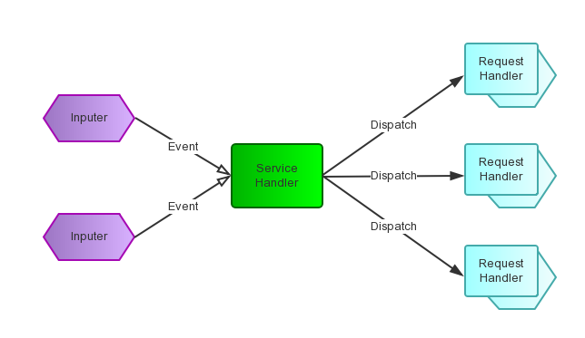

### Reactor模式

**Reactor** (反应堆)模式首先是事件驱动的，有一个或多个并发输入源，有一个Service Handler，有多个Request Handlers；这个Service Handler会同步的将输入的请求（Event）多路复用的分发给相应的Request Handler。如果用图来表达：

从结构上，这有点类似生产者消费者模式，即有一个或多个生产者将事件放入一个Queue中，而一个或多个消费者主动的从这个Queue中Poll事件来处理；而Reactor模式则并没有Queue来做缓冲，每当一个Event输入到Service Handler之后，该Service Handler会主动的根据不同的Event类型将其分发给对应的Request Handler来处理。

### Reactor模式结构

**Handle**：(句柄, handler 处理器 处理者)即操作系统中的句柄，是对资源在操作系统层面上的一种抽象，它可以是打开的文件、一个连接(Socket)、Timer等。由于Reactor模式一般使用在网络编程中，因而这里一般指Socket Handle，即一个网络连接（Connection，在Java NIO中的Channel）。这个Channel注册到Synchronous Event Demultiplexer中，以监听Handle中发生的事件，对ServerSocketChannnel可以是CONNECT事件，对SocketChannel可以是READ、WRITE、CLOSE事件等。

**Synchronous Event Demultiplexer**：(同步事件分发器 解调器/di:,mʌlti'pleksə/)阻塞等待一系列的Handle中的事件到来，如果阻塞等待返回，即表示在返回的Handle中可以不阻塞的执行返回的事件类型。这个模块一般使用操作系统的select来实现。在Java NIO中用Selector来封装，当Selector.select()返回时，可以调用Selector的selectedKeys()方法获取Set<SelectionKey>，一个SelectionKey表达一个有事件发生的Channel以及该Channel上的事件类型。上图的“Synchronous Event Demultiplexer ---notifies--> Handle”的流程如果是对的，那内部实现应该是select()方法在事件到来后会先设置Handle的状态，然后返回。不了解内部实现机制，因而保留原图。

**Initiation Dispatcher**：(初始化调度)用于管理Event Handler，即EventHandler的容器，用以注册、移除EventHandler等；另外，它还作为Reactor模式的入口调用Synchronous Event Demultiplexer的select方法以阻塞等待事件返回，当阻塞等待返回时，根据事件发生的Handle将其分发给对应的Event Handler处理，即回调EventHandler中的handle_event()方法。

**Event Handler** 定义事件处理方法：handle_event()，以供InitiationDispatcher回调使用。

**Concrete Event Handler**(adj. 具体的,实在的,水泥的)：事件EventHandler接口，实现特定事件处理逻辑。

### Reactor模式模块之间的交互

1.初始化InitiationDispatcher，并初始化一个Handle到EventHandler的Map。  
2.注册EventHandler到InitiationDispatcher中，每个EventHandler包含对相应Handle的引用，从而建立Handle到EventHandler的映射（Map）。  
3.调用InitiationDispatcher的handle_events()方法以启动Event Loop。在Event Loop中，调用select()方法（Synchronous Event Demultiplexer）阻塞等待Event发生。  
4.当某个或某些Handle的Event发生后，select()方法返回，InitiationDispatcher根据返回的Handle找到注册的EventHandler，并回调该EventHandler的handle_events()方法。  
5.在EventHandler的handle_events()方法中还可以向InitiationDispatcher中注册新的Eventhandler，比如对AcceptorEventHandler( 接收器 受体/ək'septə/)来，当有新的client连接时，它会产生新的EventHandler以处理新的连接，并注册到InitiationDispatcher中。 

### Reactor模式实现

  

