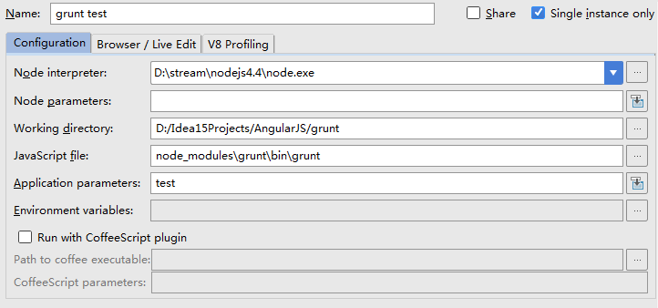

# Grunt 笔记

## 使用idea调试



## 插件记录

```bash
autoprefixer  自动生成不同浏览器特点css代码
concurrent    同时 -并发任务
clean         清除文件
compass       sass文件处理
concat        合并文件
connect       本地模拟一个web server服务
copy          复制
cssmin        css压缩
htmlmin       html压缩
imagemin      图片压缩
jshint        jshint一个js代码质量工具
uglify        js压缩工具
watch         文件监控
filerev       做文件md5  grunt-rev同样处理
google-cdn    cdn处理
jscs          js代码样式
newer         只对修改文件进行grunt 任务处理
ng-annotate   移除和重建 AngularJS 依赖注入注解
postcss       处理sasss 各种浏览器前缀兼,按官方文档的书写方式去写,会得到加上浏览器前缀的代码
svgmin        svg图形文件压缩
usemin        替换html生产环境里js和css
wiredep       将bower组件注入到html
jjt-grunt     在gruntfile里自动加载grunt任务
jshint-stylish jshintxxx美化吗？ 不知道···


```

