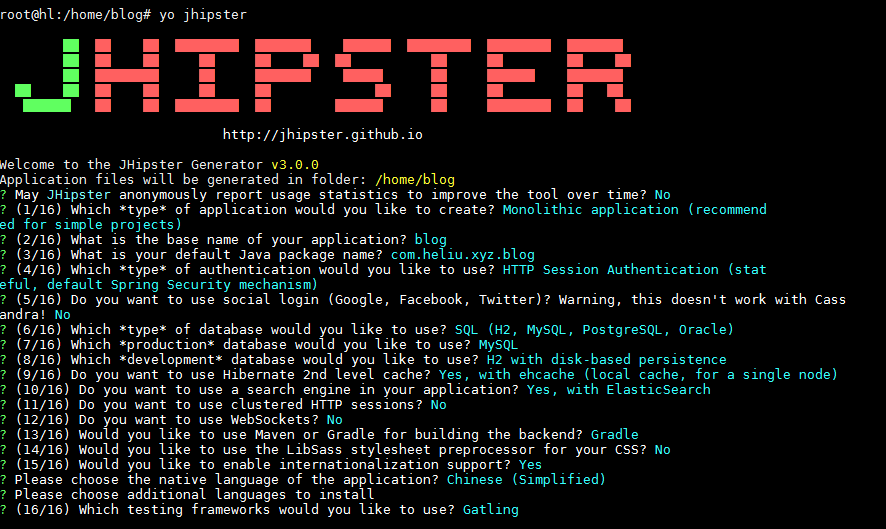

# node.js 安装

#### 安装nvm
```bash
curl -o- https://raw.githubusercontent.com/creationix/nvm/v0.31.0/install.sh | bash
```
> 设置安装路径：curl ... | NVM_DIR="path/to/nvm" bash

### sudo node问题
```bash
vi ~/.bashrc 
alias sudo='sudo '

vi ~/.nvm/nvm.sh
alias node='$NVM_BIN/node'
alias npm='$NVM_BIN/npm'


```


#### nvm安装任意版本nodejs
1. 通过`nvm ls`查看当前已经安装的node或者iojs版本；
2. 通过`nvm ls-remote`查看当前可以安装的node或者iojs版本；
3. 通过`nvm install v0.21.7`安装制定版本的nodejs；
4. 通过`nvm use v0.21.7`切换使用的nodejs版本；

#### nvm基本用法

1. nvm help：显示帮助信息
2. nvm --version：查看当前版本
3. nvm install [-s] <version>：下载安装nodejs/iojs  
4. nvm uninstall <version>：卸载安装nodejs/iojs 
5. nvm use <version> ：切换 nodejs/iojs 版本
6. nvm ls：列出当前已安装的 nodejs/iojs                
7. nvm ls-remote：列出当前可安装的nodejs/iojs 

#### npm自我更新-npm update self

	npm isntall -g npm

nvm alias default stable


```bash
curl -sL https://deb.nodesource.com/setup_5.x | sudo -E bash -
sudo apt-get install -y nodejs
```


npm install -g yo
npm install -g generator-jhipster





清除缓存
```bash
npm cache clean
```

